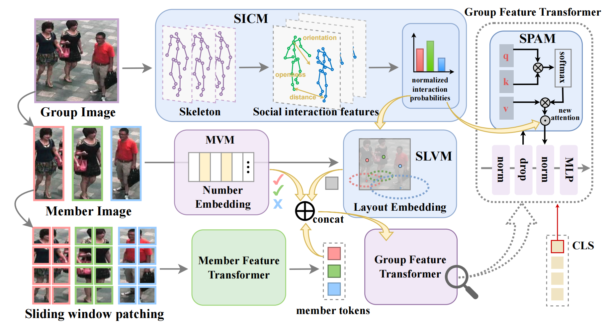
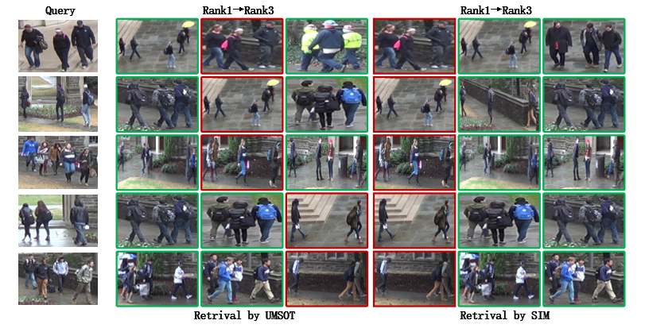

# Social Interaction Modeling for Group Re-Identification

This repository contains the implementation and supporting materials for `SIM` (Social Interaction Modeling), a framework for `Group Re-identification (G-ReID)`.

Group re-identification focuses on matching human groups across different camera views. Unlike single-person re-identification, the target is a dynamic social unit whose members may change position, partially disappear, or become occluded. SIM addresses this by modeling a group as a `social interaction field` and explicitly distinguishing between `core` and `peripheral` members.

The method is built around three components:

- `SICM` — Social Interaction Calculation Module
- `SPAM` — Social Prior Attention Mechanism
- `SLVM` — Social Layout Variation Module

These modules are designed to improve robustness to topology changes, member variation, and intra-group occlusion.

## Overview

The key idea behind SIM is that not all group members contribute equally to group identity. According to social interaction principles, central or core members are usually more stable across views, while peripheral members are more likely to move significantly or fade out of the group. SIM uses this assumption to learn more discriminative and more robust group representations.

Pipeline of SIM:



Example retrieval visualization:



## Highlights

- Models a group as a social interaction field instead of a uniform collection of members.
- Uses interaction-aware priors to differentiate core and peripheral members.
- Improves identity-focused feature learning through attention reweighting.
- Introduces layout variation modeling that better reflects realistic non-rigid group motion.
- Built on top of a transformer-based group re-identification backbone.

## Project Structure

The repository is organized into a small number of high-level components:

- `SIM/` contains the main source code, configurations, utilities, and experiment-related materials.
- `SIM/configs/` stores dataset- and model-specific configuration files.
- `SIM/fastreid/` contains the core framework implementation, including data loading, modeling, training, evaluation, and utilities.
- `SIM/tools/` provides training and evaluation entry points.
- `SIM/datasets/`, `SIM/scripts/`, `SIM/tests/`, and related directories support dataset preparation, automation, and validation.
- Root-level files such as `INSTALL.md`, `requirements.txt`, and this `README.md` provide setup and usage guidance.

This README intentionally keeps the structure description high-level so the project remains easy to navigate even as internal files evolve.

## Requirements

### Installation

Please refer to [INSTALL.md](INSTALL.md).

### Datasets

Supported datasets include:

- `CSG`
- `RoadGroup`
- `DukeGroup`

To use the `CSG` dataset, update the dataset root path in:

- [SIM/fastreid/data/datasets/CSG.py](SIM/fastreid/data/datasets/CSG.py)

Set:

```python
self.root = XXX
```

For additional dataset preparation details, refer to:

- [SIM/datasets/README.md](SIM/datasets/README.md)

### Prepare ViT Pre-trained Models

Download the required ViT pre-trained model and update the path in:

- [SIM/configs/CSG/bagtricks_gvit.yml](SIM/configs/CSG/bagtricks_gvit.yml)

Set:

```yaml
PRETRAIN_PATH: XXX
```

## Data Preprocessing

`SICM` requires social interaction information to be generated for each group image.

Run:

- [SIM/fastreid/data/transforms/CSG_interaction.py](SIM/fastreid/data/transforms/CSG_interaction.py)

Then update dataset selection in:

- [SIM/fastreid/data/common.py](SIM/fastreid/data/common.py)

The default configuration is set for `CSG`, so other datasets require corresponding adjustments.

## Training

Single-GPU and multi-GPU training are supported.

Example command:

```bash
python tools/train_net.py --config-file SIM/configs/CSG/bagtricks_gvit.yml MODEL.DEVICE "cuda:0"
```

For other datasets, change the configuration, preprocessing, dataset-loading logic, and runtime dataset selection accordingly.

## Testing

Evaluation is performed during training according to the configured evaluation period.

You can also run testing separately using the trained checkpoint and the relevant configuration file.

## Reproducibility Notes

To reproduce results on a specific dataset such as `CSG`, make sure all dataset-dependent components are aligned:

- config file in `SIM/configs/`
- interaction preprocessing script
- dataset loader selection in `SIM/fastreid/data/common.py`
- terminal command arguments
- pretrained model path

A mismatch in any of these components can lead to incorrect training or evaluation behavior.

## Backbone and Codebase

SIM is implemented on top of a transformer-based group re-identification backbone. The backbone implementation used for `SPAM` and `SLVM` can be found in:

- [SIM/fastreid/modeling/backbones/group_vit.py](SIM/fastreid/modeling/backbones/group_vit.py)

The codebase is based on:

- [fast-reid](https://github.com/JDAI-CV/fast-reid)

## Known Limitations

- The method depends on the quality of interaction-related cues such as spatial relations, member orientation, and openness estimation.
- In dense crowds, nearby pedestrians may interfere with reliable interaction modeling.
- The assumption that core members are always more stable than peripheral members is useful but not universally true.
- Reproducibility requires careful synchronization of dataset-specific configs, preprocessing scripts, and paths.
- Some parts of the implementation still reflect the assumptions and engineering choices of the original research codebase.

## Future Work

- Improve robustness when pose or orientation estimation is noisy or unavailable.
- Extend experiments to more datasets and more challenging public-space scenarios.
- Simplify dataset preparation and reduce the amount of manual path editing.
- Refactor configuration and preprocessing to make multi-dataset reproduction easier.
- Provide cleaner standalone evaluation and visualization utilities.

## Acknowledgement

This implementation builds on top of the `fast-reid` codebase. Please also refer to the original repository for additional framework usage and engineering details.
